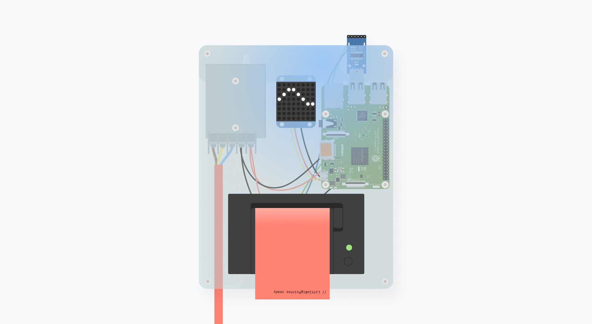

# LittleBigPrinter


This is a new version of a fax machine. 

&rarr; Send us a message via littleBigPrinter[at]gmail.com

# Hardware Setup

The laser file for the case iy in the `00_case` folder. It is intended for 3mm thick acrylic glass.


# Raspberry Pi Setup


## Install Raspbian

[Link](https://www.raspberrypi.org/documentation/installation/installing-images/)


## Allow SSH connections

[Link](https://hackernoon.com/raspberry-pi-headless-install-462ccabd75d0)

## Configure WiFi

[Link](https://raspberrypi.stackexchange.com/questions/10251/prepare-sd-card-for-wifi-on-headless-pi)

&rarr; Find suitable files within the `00_pi-setup` folder.

## Find Raspberry in terminal

to find the IP, connect a screen/keyboard to the pi and open a terminal and write `ifconfig` and look for the ip address of `eth0` 
or to find it from your computer, install *arp-scan* `brew install arp-scan` and then run `sudo arp-scan --localnet`  and search for 'Raspberry'.

`ssh pi@<IP-address>` (← Enter here your Raspberry's IP address) password is `raspberry`

connect via FTP to upload your code 
```
Host = <IP-address>
Username = pi
Password = raspberry
Port = 22
```

## Enable GPIO and I2C

Open the Raspberry in your terminal and open the config to enable GPI and I2C.
```sh
sudo raspi-config
```


## Node

update node-red, install node and yarn

```sh
sudo apt update
curl -sL https://deb.nodesource.com/setup_8.x | sudo -E bash - 
sudo apt-get install nodejs 
curl -o- -L https://yarnpkg.com/install.sh | bash 

curl -sS https://dl.yarnpkg.com/debian/pubkey.gpg | sudo apt-key add -
echo "deb https://dl.yarnpkg.com/debian/ stable main" | sudo tee /etc/apt/sources.list.d/yarn.list
sudo apt-get update && sudo apt-get install yarn
```

More detailed description [here](https://www.hackster.io/IainIsCreative/setting-up-the-raspberry-pi-and-johnny-five-56d60f).

## Install software

The code is based on node js via yarn, so open the directory and hit `yarn install`.


## Run the node js server after boot

Edit this file `sudo nano .bashrc` and add this:  
```sh
# Run node js server
sudo node /home/pi/Desktop/littlePrinter/index.js
```
Then reboot.

# Setup IMAP

Include your credentials within a `imapData.js`, including the following code:

```js
module.exports = {
	imapData : {
		'user': <Your Mail>,
		'password': <Your Password>,
		'host': <Your Host Server>
  	}
};
```